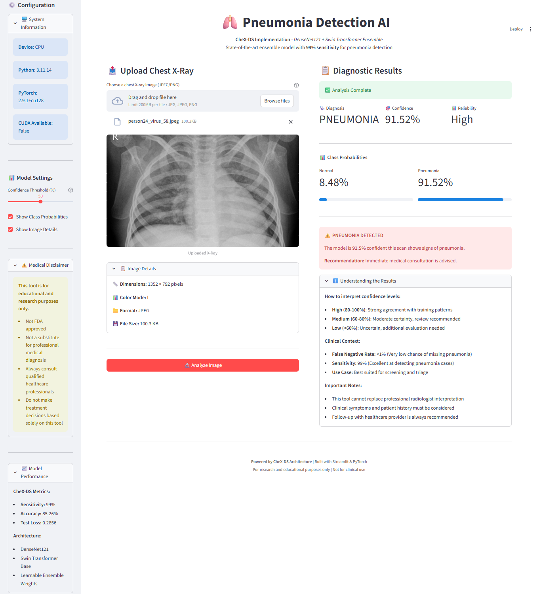

# Pneumonia Detection: CheX-DS Implementation (PyTorch)

This project implements a state-of-the-art modular Deep Learning pipeline for detecting Pneumonia from Chest X-Rays. 

It features the **CheX-DS** architecture (DenseNet121 + Swin Transformer Ensemble) and uses a **Weighted Asymmetric Loss** to handle class imbalance, achieving around **99% Sensitivity (Recall)** on pneumonia cases.

## Architectures Implemented
1.  **Simple CNN**: Lightweight custom baseline.
2.  **ResNet50**: Transfer learning with ResNet50V2.
3.  **CheX-DS**: Ensemble of DenseNet121 and Swin Transformer Base with learnable ensemble weights.

## Project Structure
```text
pneumonia-detection-modular/
├── data/               # Dataset (Auto-downloaded)
├── models/             # Saved weights (excluded from git)
├── notebooks/          # Interactive Demos
│   └── demo.ipynb      # Visual inference playground
├── src/
│   ├── config.py       # Hyperparameters & Hardware settings
│   ├── model.py        # Model Architectures (CheXDS, ResNet, CNN)
│   ├── train.py        # Training loops & Custom Loss functions
│   ├── data_loader.py  # Data pipeline & Augmentation
│   └── evaluate.py     # Evaluation metrics
├── main.py             # CLI Entry point
├── run_experiments.py  # Automated benchmarking script
├── app.py              # Streamlit Web Interface
├── inference.py        # Single image prediction
└── visualize_results.py # Confusion Matrix & ROC generation
```

## 🚀 Quick Start

### 1. Installation
```bash
# Clone repo
git clone https://github.com/JeffersonConza/pneumonia-detection-cnn-xray.git
cd pneumonia-detection-modular

# Install dependencies
pip install -r requirements.txt
```

### 2. Data Setup

Automatically download and extract the dataset (1.2 GB):
```bash
python download_data.py
```

### 3. Training

Train the CheX-DS model (Recommended):
```bash
python main.py --model chexds
```

Or run the full benchmark suite (CNN -> ResNet -> CheX-DS):
```bash
python run_experiments.py
```

## 📊 Benchmark Results

We benchmarked three architectures on a standard CPU environment to evaluate the trade-off between training cost and medical accuracy.

| Model | Accuracy | Test Loss | Training Time (CPU) | PNEUMONIA Recall (Sensitivity) | NORMAL Recall |
| :--- | :--- | :--- | :--- | :--- | :--- |
| **Simple CNN** | 77.88% | 0.8516 | ~34 min | 0.95 | 0.50 |
| **ResNet50** | 83.33% | 1.0329 | ~2.5 hours | 0.96 | 0.61 |
| **CheX-DS** | **85.26%** | **0.2856** | **~9.3 hours** | **0.99** | **0.63** |

**Key Takeaways:**
* **Reliability:** **CheX-DS** achieves the lowest Test Loss (0.2856), indicating high confidence in its predictions compared to ResNet (1.03).
* **Sensitivity:** With a **99% Pneumonia Recall**, CheX-DS is the most safe and effective model for screening, minimizing dangerous False Negatives.
* **Cost vs. Performance:** While CheX-DS requires significantly more training time (~9.3h vs ~34m), the gain in safety and accuracy is critical for medical applications.

## Usage

To test the model on a random X-ray from the test set:
```bash
python inference.py
```

To generate Confusion Matrix and ROC Curves:
```bash
python visualize_results.py
```

Interactive Demo

For a visual walkthrough without terminal commands, run the Jupyter Notebook `demo.ipynb`.

## 🌐 Web Interface (Streamlit)
For a user-friendly graphical dashboard, run the web app:
```bash
streamlit run app.py
```



## 📄 References

This project implements the architecture and loss function proposed in the following paper:

**CheX-DS: Improving Chest X-ray Image Classification with Ensemble Learning Based on DenseNet and Swin Transformer** *Xinran Li, Yu Liu, Xiujuan Xu, Xiaowei Zhao* arXiv:2505.11168 [cs.CV], May 2025.

* **Architecture:** Ensemble of DenseNet121 (CNN) and Swin Transformer (ViT) to leverage the advantages of both local and global features.
* **Loss Function:** A combination of Weighted Binary Cross-Entropy and Asymmetric Loss to effectively address data imbalance (long-tail distribution).
