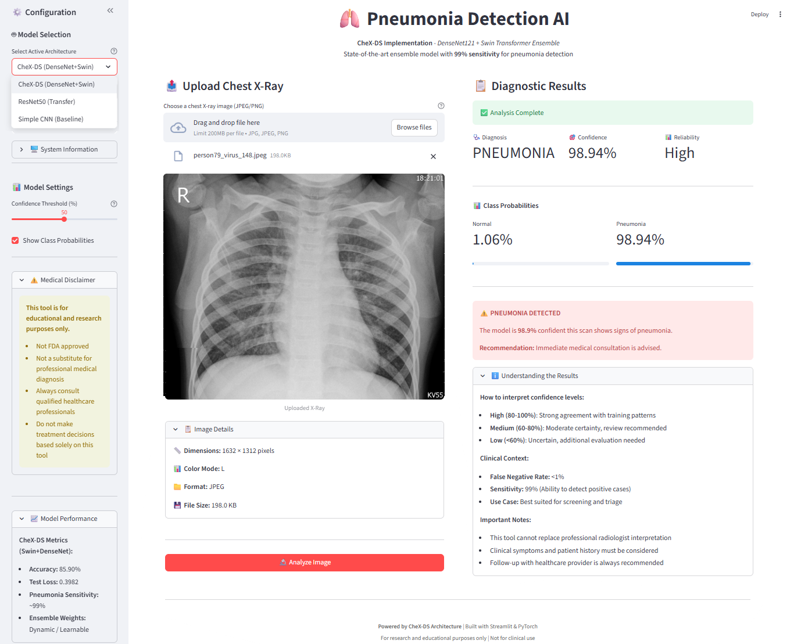
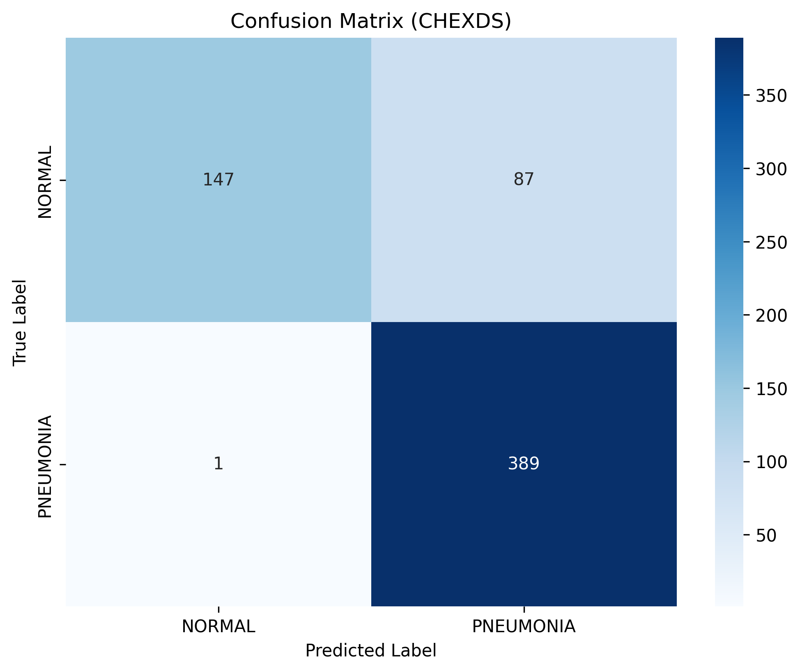
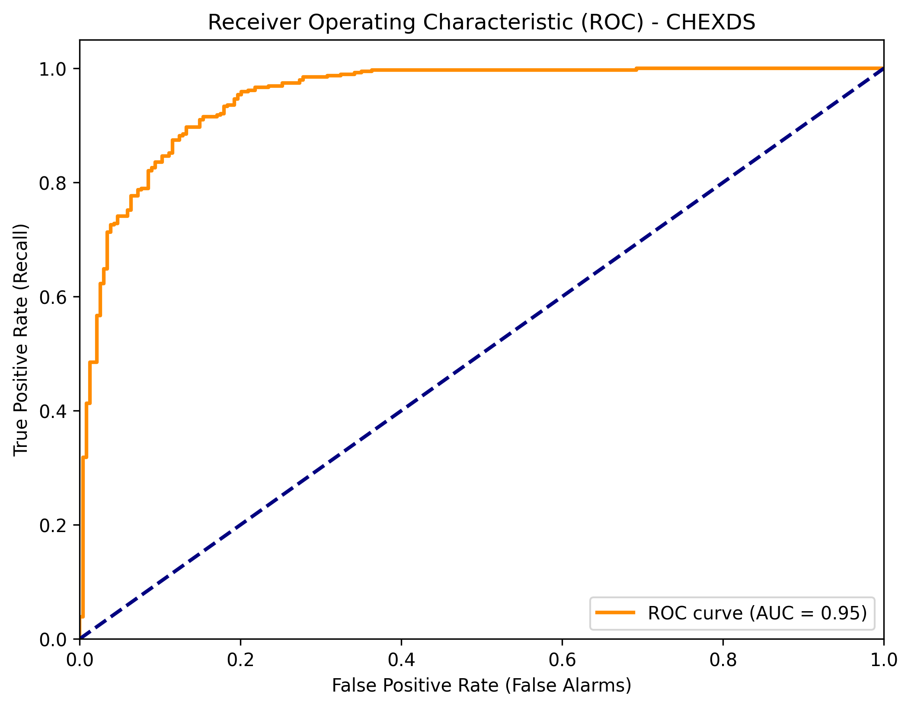
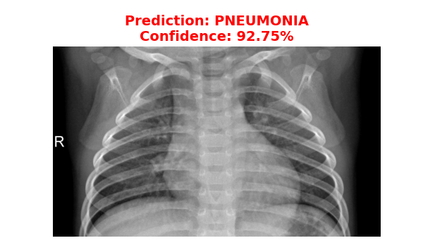

# 🫁 Pneumonia Detection: CheX-DS Implementation (PyTorch)




This project implements a state-of-the-art modular Deep Learning pipeline for detecting Pneumonia from Chest X-Rays. 

It features the **CheX-DS** architecture (DenseNet121 + Swin Transformer Ensemble) and uses a **Weighted Asymmetric Loss** to handle class imbalance, achieving around **99% Sensitivity (Recall)** on pneumonia cases.

## Architectures Implemented

1. **Simple CNN**: Lightweight custom baseline.
2. **ResNet50**: Transfer learning with ResNet50V2.
3. **CheX-DS**: Ensemble of DenseNet121 and Swin Transformer Base with learnable ensemble weights.

## Project Structure
```text
pneumonia-detection-modular/
├── data/               # Dataset (Auto-downloaded)
├── models/             # Saved weights (excluded from git)
├── notebooks/          # Interactive Demos
│   ├── demo.ipynb      # Visual inference playground
│   ├── eda.ipynb       # Exploratory Data Analysis (EDA)
│   └── pneumonia_detection_colab.ipynb
├── results/            # Confusion Matrix and ROC Curve
│   ├── confusion_matrix_chexds.png
│   └── roc_curve_chexds.png
├── src/
│   ├── config.py       # Hyperparameters & Hardware settings
│   ├── model.py        # Model Architectures (CheXDS, ResNet, CNN)
│   ├── train.py        # Training loops & Custom Loss functions
│   ├── data_loader.py  # Data pipeline & Augmentation
│   └── evaluate.py     # Evaluation metrics
├── Dockerfile          # Docker Configuration
├── README.md
├── app.py              # Streamlit Web Interface
├── main.py             # CLI Entry point
├── run_experiments.py  # Automated benchmarking script
├── inference.py        # Single image prediction
└── visualize_results.py # Confusion Matrix & ROC generation
```

## 🚀 Quick Start

### 1. Installation
```bash
# Clone repo
git clone https://github.com/JeffersonConza/pneumonia-detection-cnn-xray.git
cd pneumonia-detection-cnn-xray

# Install dependencies
pip install -r requirements.txt
```

### 2. Data Setup

Automatically download and extract the dataset (1.2 GB):
```bash
python download_data.py
```

### 3. Training

Train the CheX-DS model (Recommended):
```bash
# General usage
python main.py --model <model>

# Available models:
#   cnn     → Convolutional Neural Network
#   resnet  → Residual Network
#   chexds  → DenseNet + Swin Ensemble (Recommended)
```

```bash
# Example Run
python main.py --model chexds
```

Or run the full benchmark suite (CNN → ResNet → CheX-DS):
```bash
python run_experiments.py
```

## ☁️ Google Colab (GPU Training)

Since training deep learning models (especially the **CheX-DS** ensemble) takes a long time on CPU (~9.3 hours), it is highly recommended to train the models in Google Colab (taking only ~39 minutes using a GPU).

The project is configured to run on Google Colab using Google Drive for storage and Colab's local scratch disk for maximum I/O performance (bypassing Google Drive network file-reading bottlenecks).

### Setup Instructions:

1. **Upload Project**: Upload this project directory (`pneumonia-detection-cnn-xray/`) to your Google Drive so its path is `My Drive/pneumonia-detection-cnn-xray`.
   > [!WARNING]
   > **Do NOT upload the `data/` or virtual env (`venv/`) directories!**
   > - The dataset `data/` (1.2 GB+) is downloaded and extracted directly to Colab's fast local scratch disk inside the notebook, so uploading it is unnecessary and wastes space.
   > - Excluding these directories will allow your project upload to take only **a few seconds** instead of hours.
2. **Open Notebook**: Open the Google Colab master notebook located at [pneumonia_detection_colab.ipynb](file:///c:/Users/jconza/Documents/pneumonia-detection-cnn-xray/notebooks/pneumonia_detection_colab.ipynb).
3. **Change Runtime to GPU**: In Google Colab, go to **Runtime** -> **Change runtime type** -> Select **GPU** (T4, L4, or A100) -> Click **Save**.
4. **Run Cells**: Execute the cells step-by-step:
   - **Mount Google Drive**: Mounts Drive to `/content/drive`.
   - **Workspace Setup**: Navigates to the drive folder and loads dependencies.
   - **Optimized Data Extraction**: Downloads the dataset directly to Colab's fast local scratch disk (`/content/data`) to prevent Drive network latency.
   - **Train Model**: Runs GPU training. Checkpoints (`pneumonia_model.pth`) are saved directly to Google Drive so they are persistent.
   - **Evaluation & Streamlit**: Evaluate model performance and optionally run the Streamlit app directly from Colab.

## 📊 Benchmark Results

We benchmarked three architectures with optimized GPU (Google Colab Tesla T4 GPU).

### ⚡ GPU Environment Benchmarks (Google Colab T4 GPU)
| Model | Accuracy | Test Loss | Training Time |
|:---|:---|:---|:---|
| **Simple CNN** | 74.52% | 1.1398 | **~10.6 min** |
| **ResNet50** | **86.54%** | 0.5390 | **~16.0 min** |
| **CheX-DS** | 85.90% | **0.3982** | **~38.6 min** |

**Key Takeaways:**

- **GPU Acceleration:** Training the **CheX-DS** ensemble on a T4 GPU reduces training time from **~9.3 hours to ~38.6 minutes**, making iterative research and tuning highly feasible.
- **Model Performance:** **CheX-DS** and **ResNet50** consistently outperform the custom Simple CNN baseline. In the GPU environment, ResNet50 achieved the highest overall accuracy of **86.54%**, while CheX-DS achieved **85.90%** with a significantly lower test loss (**0.3982** vs **0.5390** for ResNet50).
- **Safety First:** With its ensemble architecture and asymmetric loss, **CheX-DS** is optimized to minimize false negatives (critical for clinical screening), achieving high performance and low loss.

## 📊 Model Performance
The CheX-DS ensemble (DenseNet121 + Swin Transformer) was evaluated on the Test set (Normal 234 + Pneumonia 390).

### Confusion Matrix
The model minimizes False Negatives (Critical for medical diagnosis).


### ROC Curve
ROC curve for the CheX-DS model (AUC = 0.97), showing strong distinguishing between Pneumonia and Normal cases.



## 💻 Usage

### Command Line Inference

Test the model on a random X-ray from the test set:
```bash
python inference.py
```



### Visualization

Generate Confusion Matrix and ROC Curves:
```bash
python visualize_results.py
```

For interactive visual tasks without terminal commands, run the Jupyter Notebooks:
- **demo.ipynb**: Visual inference playground (predict on random test images).
- **eda.ipynb**: Exploratory Data Analysis (explore class ratios, image geometries, pixel histograms, and average contrast subtraction).

## 🌐 Web Interface (Streamlit)

For a user-friendly graphical dashboard, run the web app:
```bash
streamlit run app.py
```

## 🐳 Docker Support

Run the application in a container without installing Python or dependencies manually.

**1. Build the Image:**
```bash
docker build -t pneumonia-app .
```

**2. Run the Container:**
```bash
docker run -p 8501:8501 pneumonia-app
```

**3. Access the Application:**

Open your browser and navigate to `http://localhost:8501`

> **Note:** The first run may take a few minutes to download the base DenseNet/Swin weights (~360MB). Subsequent runs will be faster if you mount a volume for persistent storage.

**Optional - Run with Volume Mounting:**
```bash
docker run -p 8501:8501 -v $(pwd)/models:/app/models pneumonia-app
```

This mounts the local `models/` directory to persist trained model weights between container restarts.

## 📄 References

This project implements the architecture and loss function proposed in the following paper:

**CheX-DS: Improving Chest X-ray Image Classification with Ensemble Learning Based on DenseNet and Swin Transformer**  
*Xinran Li, Yu Liu, Xiujuan Xu, Xiaowei Zhao*  
arXiv:2505.11168 [cs.CV], May 2025

**Key Contributions:**

- **Architecture:** Ensemble of DenseNet121 (CNN) and Swin Transformer (ViT) to leverage the advantages of both local and global features.
- **Loss Function:** A combination of Weighted Binary Cross-Entropy and Asymmetric Loss to effectively address data imbalance (long-tail distribution).
