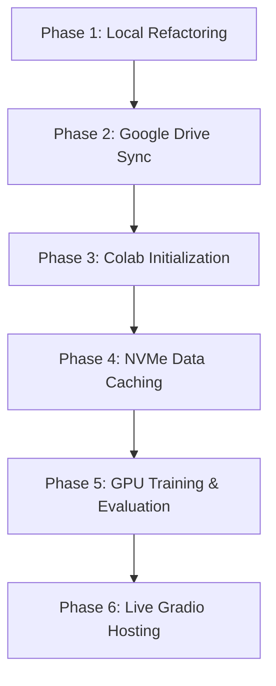

# 🫁 Engineering Phases: Pneumonia Detection AI Google Colab Migration

This document outlines the step-by-step phases to transition the Pneumonia Detection AI pipeline from local CPU execution to a **100% Google Colab GPU environment**. 

Following these phases will optimize training speed (using AMP and local NVMe SSD caching) and resolve interface hosting restrictions (using Gradio).

---

## 🗺️ Migration Roadmap (Phases)



---

### Phase 1: Local Code Refactoring & GPU Optimization
Before uploading the codebase to Google Drive, refactor the existing scripts locally to support Google Colab path structures and hardware acceleration.

1.  **Dynamic Configuration ([src/config.py](file:///mnt/c/Users/jconza/Downloads/pneumonia-detection-cnn-xray/src/config.py))**:
    *   Detect if running in Google Colab (by checking for `/content`).
    *   Direct `DATA_DIR` to Colab's fast local SSD (`/content/chest_xray`) to prevent training latency.
    *   Set `MODEL_SAVE_PATH` to point to the mounted Google Drive workspace so checkpoints are saved persistently.
2.  **GPU Training Optimizations**:
    *   Enable **Automatic Mixed Precision (AMP)** (`USE_AMP = True` if GPU is available) in [config.py](file:///mnt/c/Users/jconza/Downloads/pneumonia-detection-cnn-xray/src/config.py) and [train.py](file:///mnt/c/Users/jconza/Downloads/pneumonia-detection-cnn-xray/src/train.py) to train models in `float16` precision, reducing training times by up to 50%.
    *   Scale the training `BATCH_SIZE` to `64` or `128` (up from `32`) to utilize the GPU's VRAM.
    *   Configure PyTorch's `DataLoader` in [data_loader.py](file:///mnt/c/Users/jconza/Downloads/pneumonia-detection-cnn-xray/src/data_loader.py) with `num_workers=2` and `pin_memory=True` to prevent CPU bottlenecks.
3.  **Directory Check Bugfix**:
    *   In [train.py](file:///mnt/c/Users/jconza/Downloads/pneumonia-detection-cnn-xray/src/train.py), inject `os.makedirs(os.path.dirname(MODEL_SAVE_PATH), exist_ok=True)` before `torch.save()` to prevent path-not-found crashes on Google Drive.

*Note: All these changes have already been applied to your local codebase files.*

---

### Phase 2: Google Drive Synchronization
Synchronize your local workspace to Google Drive to make the codebase accessible inside Colab.

1.  **Exclude Heavy Folders**:
    *   Do **NOT** upload the `data/` folder (1.2GB) or the `.venv/` folder to Google Drive. These folders will be dynamically generated on-demand inside Google Colab, saving you time during upload.
2.  **Upload to Drive**:
    *   Upload the root folder `pneumonia-detection-cnn-xray/` to your Google Drive. 
    *   By default, the path is expected to be: `/My Drive/pneumonia-detection-cnn-xray`.

---

### Phase 3: Colab Notebook Setup & Device Verification
Configure a master notebook ([run_colab.ipynb](file:///mnt/c/Users/jconza/Downloads/pneumonia-detection-cnn-xray/run_colab.ipynb)) inside Google Colab to mount your Drive and load libraries.

1.  **Mount Drive**:
    ```python
    from google.colab import drive
    drive.mount('/content/drive')
    ```
2.  **Workspace Directory Mapping**:
    ```python
    import os
    os.chdir('/content/drive/MyDrive/pneumonia-detection-cnn-xray')
    ```
3.  **Hardware Verification**:
    ```python
    import torch
    print("GPU Available:", torch.cuda.is_available())
    ```
4.  **Install dependencies**:
    ```bash
    !pip install -r requirements.txt
    !pip install gradio
    ```

---

### Phase 4: Local VM Data Caching (SSD Performance)
Avoid reading training images directly from Google Drive. Reading thousands of small files over Drive's network-mounted filesystem will bottleneck training loops.

1.  **Fast Decompression Command**:
    ```python
    # Download directly into Colab SSD scratch storage
    !mkdir -p /content/data
    !curl -L -o /content/xray_dataset.tar.gz "https://dsserver-prod-resources-1.s3.amazonaws.com/cnn/xray_dataset.tar.gz"
    print("Decompressing tarball to local SSD...")
    !tar -xzf /content/xray_dataset.tar.gz -C /content/
    print("Dataset successfully extracted locally at /content/chest_xray")
    ```
    *This downloads and extracts the 1.2GB dataset to Colab's NVMe local SSD in under 30 seconds.*

---

### Phase 5: GPU-Accelerated Pipelines (Training & Plotting)
Train and evaluate models inside the Colab session.

1.  **Ensemble Model Training**:
    ```bash
    # Runs the DenseNet121 + Swin Transformer training with AMP
    !python main.py --model chexds
    ```
    *Weights are saved back to your Google Drive folder persistently.*
2.  **Visual Analytics**:
    ```bash
    # Generates Confusion Matrix and ROC Curves
    !python visualize_results.py
    ```

---

### Phase 6: GUI Deployment (Gradio Server)
Deploy the user interface from Colab.

1.  **Expose Interface**: Expose the trained model using Gradio which creates secure public tunnels:
    ```bash
    # Runs the gradio interface server live from Colab GPU
    !python gradio_app.py
    ```
2.  **Public URL**: Click the public Hugging Face URL printed in the output to run diagnostics in your browser.
